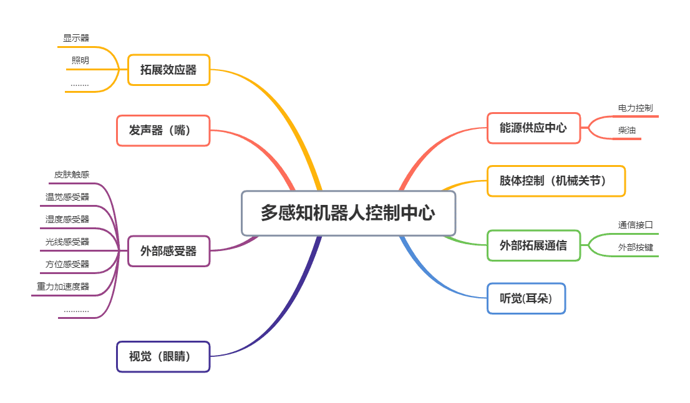

### Multi-perception Biped Robot Based on Raspberry_Pi

_You can also read a translated version of this file [in Chinese 简体中文版](https://github.com/ClimbSnail/Robot_For_RaspberryPi/blob/master/README.md) or [in Korean 한국어]()._

The project comes from my undergraduate graduation design.

I made a version before the earliest, which was controlled offline by single chip microcomputer. You can preview it first.

Bilibili [Video](https://b23.tv/BV1qs411L7Pn) https://b23.tv/BV1qs411L7Pn
<iframe
	src="//player.bilibili.com/player.html?aid=25532479&bvid=BV1qs411L7Pn&cid=43483717&page=1"
	scrolling="no"
	width="800px"
	height="600px"
	border="0"
	frameborder="no"
	framespacing="0"
	allowfullscreen="true"> 
</iframe>

ExpansionBoard of RaspberryPi [Video](https://b23.tv/BV1zt411u7LR) https://b23.tv/BV1zt411u7LR
<iframe
	src="//player.bilibili.com/player.html?aid=62017744&bvid=BV1zt411u7LR&cid=107821320&page=1"
	scrolling="no"
	width="800px"
	height="600px"
	border="0"
	frameborder="no"
	framespacing="0"
	allowfullscreen="true"> 
</iframe>

The whole project is a combination of software and hardware, providing all source codes of the whole circuit engineering files and related functions.

Development languages `C`、`C++`、`Python`、`C#`.

#### Robot Design Structure Diagram

   

#### 3D Preview of PCB

#### Introduction to the document
* RPI_ExpansionBoard_Code _(Raspberry pie development board built-in STM32 program MDK5 project)_
* RaspberryPi Expansion Board (STM32C8T6 Version) _(Raspberry Expansion Board AD Circuit Engineering Document)_

#### Code Structure ( in RpiSrc path )
The design of the whole code follows high cohesion and low coupling. Each sub-module can be used alone and has a corresponding demo inside.

* robot_main.py _(controller of the whole robot)_
* mylogger.py _(log printing module, almost used in the code of this project)_
* baidu_speech.py _(Baidu Speech Recognition and Synthesis)_
* face_recognition.py _(face detection and recognition based on opencv)_
* GPIO.py _(IO-driven API for strawberry pie development board)_
* read_action.py _(read of action group file)_
* nowboydecoder.py _(voice wake-up support file)_
* nowboydetect.py _(voice wake-up support file)_
* turing_robot.py _(Turing Robot Dialogue)_
* playsound.py _(music player under windows)_
* robotsocket.py _(communicating with the upcoming windows client)_
* file_trans_manager.py _(file manager, tcp-based multithreaded transceiver)_
* config.py _(processing configuration files)_
* default.cfg _(default configuration file used by robot_main. Py)_
* Action _(folder where action groups are stored)_
* BaiduSpeak _(baidu_speak. Py default cache folder)_
* Data _(model folder for opencv face detection)_
* The rest are reference pictures 

#### Supplement

All the functions have been realized, and the relevant contents have been completed and updated in a unified way.

The related windows clients will also be updated later. 
Relevant [Multi-platform clients](https://github.com/ClimbSnail/RobotGeneralController) are also constantly being updated.